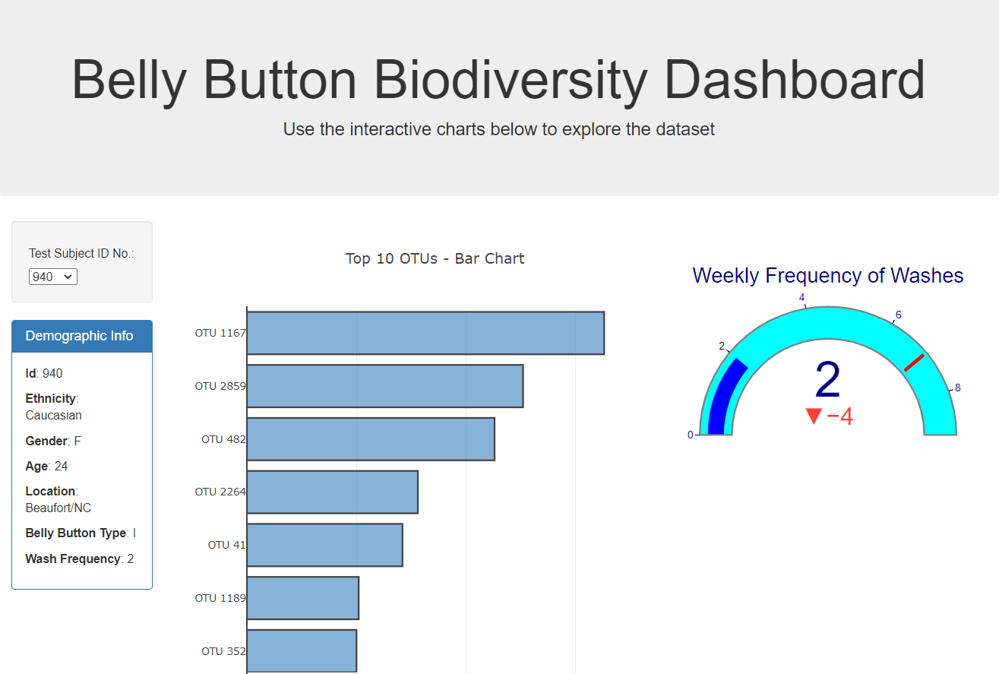

# Plot.ly - Belly Button Biodiversity

Interactive dashboard to explore the [Belly Button Biodiversity dataset](http://robdunnlab.com/projects/belly-button-biodiversity/), which catalogs the microbes that colonize human navels.

The dataset reveals that a small handful of microbial species (also called operational taxonomic units, or OTUs, in the study) were present in more than 70% of people, while the rest were relatively rare.

## Deployment

[Live Dashboard Link](https://mwansamwango.github.io/belly-button-biodiversity/)

## Dashboard Features

1. D3 library to read in `samples.json`.

  

3. Plotly bubble chart that displays each sample.

4. Displays the sample metadata, i.e., an individual's demographic information.

5. Updates all of the plots any time that a new sample is selected.

6. Displays weekly frequency wahses using guage with 6 washes assumed to be minimum.

Gauge Chart from <https://plot.ly/javascript/gauge-charts/> to plot the weekly washing frequency of the individual.

* Gauge code to account for values ranging from 0 through 9.

* Updates the chart whenever a new sample is selected.

## Technology Stack

* Javascript
* D3 
* Refer to the [Plotly.js documentation](https://plot.ly/javascript/) when building the plots.

### About the Data

Hulcr, J. et al.(2012) _A Jungle in There: Bacteria in Belly Buttons are Highly Diverse, but Predictable_. Retrieved from: [http://robdunnlab.com/projects/belly-button-biodiversity/results-and-data/](http://robdunnlab.com/projects/belly-button-biodiversity/results-and-data/)

- - -
